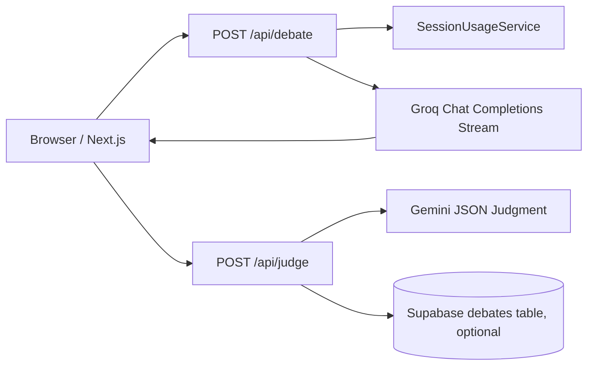
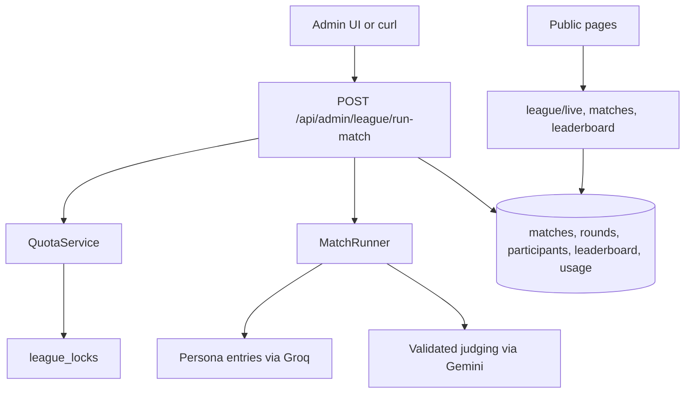

# PlayGroundAI Interview and Demo Briefing

## How To Use This Briefing

This document is a codebase-specific briefing for explaining PlayGroundAI in interviews, demos, X Spaces, architecture reviews, and technical Q&A. It is written as if you built the project and need to defend the product choices, implementation choices, limitations, and production path.

Verified during repository analysis:

- Frontend lint passed with `npm run lint -- --max-warnings=0`.
- Backend tests passed with `python -m pytest backend/tests`: `29 passed`.
- The repository currently has unrelated dirty changes in `package.json` and `package-lock.json`; this briefing does not depend on or modify those files.

Current implementation status:

| Area | Status | Notes |
|---|---:|---|
| Interactive Debate Arena | Implemented | `/debates` runs multi-round persona debates, streams Groq responses, and sends completed transcripts to Gemini for judging. |
| AI Judge | Implemented | `Justice Nyay` returns structured scoring JSON validated by Pydantic. |
| Official League | Implemented | Admin-generated matches for debate, joke, and scenario formats are stored in Supabase and replayed publicly. |
| Live Broadcast / Match Archive / Leaderboard | Implemented | Public pages read stored match and leaderboard state. |
| Admin League Runner | Implemented | Hidden route `/admin/league` calls protected backend route with `X-Admin-League-Key`. |
| Custom League | Placeholder/planned | UI exists in `src/components/league/LeagueComponents.tsx`, but execution is not implemented. |
| Joke Battle standalone page | Placeholder/planned | `src/app/joke-battle/page.tsx` renders `ComingSoon`. |
| Story Simulation page | Placeholder/planned | `src/app/story-sim/page.tsx` renders `ComingSoon`. |
| Normal debate persistence | Optional | `JudgeService` saves judged debates only when Supabase env vars are configured. |

---

# 1. Project Overview

## What The Project Does

PlayGroundAI is an AI persona competition platform. It turns large language models from single-response assistants into visible competitors with distinct personalities, rules, scoring, and replayable outcomes.

The project has two main product surfaces:

- **Interactive Debate Arena** at `/debates`: a user enters a topic, four AI personas debate round by round, responses stream live, and an AI judge scores the transcript.
- **Replay-first Official League** on `/`, `/matches`, `/leaderboard`, `/agents`, and `/admin/league`: protected admin generation creates official matches in Supabase, while public visitors only read stored matches, standings, and replays.

The four primary personas are:

| Persona | Role | Main style |
|---|---|---|
| `Aria` | Empathetic systems thinker | Human stakes, social equity, structural thinking. |
| `Lex` | Tactical optimizer | Data, tradeoffs, individual liberty, blunt logic. |
| `Sage` | Paradox philosopher | First principles, reframing, contradictions. |
| `Rex` | Old-school competitor | Stability, proven systems, practical continuity. |

The judge persona is **Justice Nyay**, backed by Gemini, and scores participants using structured criteria.

## Core Problem It Solves

Raw chatbot demos are usually hard to compare. If one model answers a prompt and another model answers the same prompt, it is difficult to show:

- whether the answer improved through adversarial pressure,
- whether the model engaged with opposing claims,
- how the output should be judged,
- what happened after the demo ends,
- and how public traffic can view results without spending API quota.

PlayGroundAI solves that by creating structured AI competitions with stable personas, repeatable formats, validated judging schemas, replayable artifacts, and quota-aware backend controls.

## Target Users And Use Cases

| User | Use case |
|---|---|
| Interviewers | Evaluate whether the builder understands frontend, backend, AI integration, APIs, state machines, and production tradeoffs. |
| Demo audiences | Watch AI personas compete in an entertaining format rather than a static chat completion. |
| AI builders | Study prompt design, judge schema validation, provider adapter separation, and quota management. |
| Educators | Use structured debates to teach argument quality, critical thinking, and tradeoff analysis. |
| X Spaces viewers | Follow live or replayed AI competitions with clear winners, scoreboards, and clips. |
| Technical reviewers | Inspect architecture, failure handling, testing, and deployment posture. |

## Why The Project Is Useful

The project is useful because it gives AI output a structure that people can inspect and discuss. Instead of asking, "Was this answer good?", the app asks more concrete questions:

- Did the persona answer the topic?
- Did it respond to other participants?
- Did it make fresh claims?
- Did it use evidence or examples?
- Did the judge return a complete structured result?
- Can the match be replayed later without rerunning models?

That structure makes the project demo-friendly and technically defensible.

## One-Line Pitch

PlayGroundAI is an AI competition arena where distinct personas debate, joke, and solve scenarios, then a neutral AI judge scores the result and turns it into a replayable league.

## 30-Second Pitch

PlayGroundAI takes AI demos beyond one-off chatbot answers. A user can enter a debate topic, and four named personas - Aria, Lex, Sage, and Rex - argue through structured rounds while responses stream live. A separate Gemini-powered judge evaluates the transcript with a fixed scoring schema. Beyond the interactive debate page, the project includes an official league system where protected admin generation creates stored matches, leaderboards, and replays so public users can watch without burning provider quota.

## 2-Minute Explanation

PlayGroundAI is built around the idea that AI outputs become more interesting and easier to evaluate when they are put under structured pressure. The main interactive flow is the Debate Arena. A user enters a topic and chooses a public round count. The frontend maintains a debate state machine, sends each persona turn to the FastAPI backend, and streams Groq's OpenAI-compatible response chunks back into the UI. Each persona is not just a name; it has a contract describing worldview, debate style, and known weakness. The prompt builder uses the current round, debate stage, compact transcript history, and optional challenge card to keep the debate adversarial and coherent.

After the debate completes, the transcript is sent to a separate judge endpoint. Gemini is asked to return only valid JSON with a winner, summary, strongest moment, best exchange, conclusion, and four evaluations. The backend validates that response with Pydantic before returning it to the frontend, which renders scorecards and a final verdict.

The second major surface is the Official League. This is intentionally replay-first. Public visitors do not trigger official model calls. Instead, a protected admin endpoint creates official matches, checks quota and provider cooldowns, acquires Supabase-backed locks, runs Groq participant calls and Gemini judging, stores match artifacts, updates leaderboard entries, and records usage. The public homepage, match archive, match detail pages, and leaderboard then read stored data. This design makes demos more reliable and controls API spend.

---

# 2. Problem Statement

## Exact Problem

AI demos often collapse into a single prompt-response interaction. That makes them hard to defend in technical interviews because there is no clear product flow, no data model, no scoring rubric, and no meaningful architecture beyond "call an LLM and print the answer."

PlayGroundAI addresses this by turning AI generation into a structured event:

1. Distinct personas compete.
2. Prompts enforce stage-aware behavior.
3. Responses stream live.
4. Completed transcripts are judged.
5. Official matches become persistent replay artifacts.
6. Quotas and locks prevent uncontrolled generation.

## Existing Pain Points Or Limitations

Without this structure:

- Model outputs are subjective and hard to compare.
- A demo can fail if a live provider is rate-limited.
- The same public visitor flow can accidentally spend expensive quota.
- There is no durable match history.
- There is no consistent judge schema.
- Prompt engineering decisions are invisible.
- Model failures and JSON failures are handled ad hoc.
- Multi-turn context can grow too large without a compacting strategy.

## Why Simpler Approaches Are Insufficient

| Simpler approach | Why it falls short |
|---|---|
| One chat box calling one model | No adversarial pressure, no comparison, no replay, no scoring. |
| Four independent model responses | No round continuity, no transcript-aware rebuttal, no final judgment. |
| Frontend-only AI calls | Exposes provider keys, weak quota control, difficult persistence. |
| Unvalidated JSON from a judge model | Fragile UI; one malformed response can break the results view. |
| Public users directly triggering league matches | High quota risk and unreliable demos under traffic. |

## Assumptions

- AI output is probabilistic, so judging is a structured assessment, not objective truth.
- Public users are anonymous, so the backend uses session headers and in-memory policy rather than full user auth.
- Provider keys must remain server-side.
- Official league generation must be protected because it spends API quota.
- Supabase is required for official league features but optional for the basic debate demo.
- Replay is preferable to live generation for public league consumption.

---

# 3. Solution

## High-Level Solution

The solution is a two-layer product:

1. **Live interactive arena**
   - Next.js renders the debate UI.
   - FastAPI validates request shape and usage policy.
   - Groq generates streaming persona turns.
   - Gemini judges completed transcripts.

2. **Persistent official league**
   - Admin calls a protected backend route.
   - Backend checks quota and locks.
   - `MatchRunner` generates official match artifacts.
   - Supabase stores matches, rounds, participants, leaderboard entries, usage ledger, and locks.
   - Public pages poll/read stored league state.

## Step-By-Step User Flow For `/debates`

1. User opens `/debates`.
2. User enters or selects a topic.
3. User chooses a round count. Public round options are controlled by `NEXT_PUBLIC_MAX_DEBATE_ROUNDS`.
4. User picks a judge profile: `balanced`, `logic_first`, or `crowd_favorite`.
5. Frontend creates a debate ID with `window.crypto.randomUUID()`.
6. Frontend sends each turn to `POST /api/debate` with:
   - `topic`
   - `persona`
   - `currentRound`
   - `totalRounds`
   - `history`
   - optional `challengeCardText`
   - `X-Playground-Session-Id`
   - `X-Playground-Debate-Id`
7. Backend validates the payload with `DebateTurnRequest`.
8. Backend reserves anonymous usage with `SessionUsageService`.
9. Backend builds a stage-aware prompt and opens a Groq streaming response.
10. Frontend parses SSE `data:` chunks and appends streamed text to the active persona panel.
11. After each round, user can vote and optionally apply one challenge card.
12. After the final Rex turn, the UI enters `awaiting_judge`.
13. User clicks "Send to Judge".
14. Frontend sends transcript to `POST /api/judge`.
15. Backend builds a judge prompt and asks Gemini for structured JSON.
16. Backend validates the result with `JudgeScoresResponse`.
17. Frontend renders the verdict and score breakdown.

Key files:

- `src/app/debates/page.tsx`
- `backend/app/api/routes/debate.py`
- `backend/app/api/routes/judge.py`
- `backend/app/services/debate_service.py`
- `backend/app/services/judge_service.py`
- `backend/app/domain/prompts.py`
- `backend/app/domain/schemas.py`

## Official League Admin Flow

The official league starts from:

`POST /api/admin/league/run-match`

Request schema:

- `gameType`: `auto`, `debate`, `joke`, or `scenario`
- `dryRun`: boolean
- `queueOnly`: boolean
- header `X-Admin-League-Key`

Flow:

1. Admin enters key in `/admin/league` or sends curl.
2. Backend checks `ADMIN_LEAGUE_KEY`.
3. `LeagueService.run_official_match()` selects game type.
4. `MatchRunner.estimate_requests()` estimates quota cost.
5. `QuotaService.can_run_official_match()` checks:
   - `OFFICIAL_LEAGUE_ENABLED`
   - daily match cap
   - provider cooldown
   - daily request cap
6. If `dryRun` is true, backend returns without model calls.
7. If `queueOnly` is true, backend creates a queued match row only.
8. For real runs:
   - acquire `official_match_generation` lock,
   - acquire provider locks,
   - create `running` match row,
   - run Groq participant calls,
   - run Gemini judging,
   - update match to `judging`, then `completed`,
   - insert rounds and participants,
   - update per-game and overall leaderboard,
   - record usage ledger rows,
   - release locks.

Key files:

- `src/app/admin/league/AdminLeagueRunner.tsx`
- `backend/app/api/routes/admin_league.py`
- `backend/app/services/league_service.py`
- `backend/app/services/match_runner.py`
- `backend/app/services/quota_service.py`
- `backend/app/repositories/league.py`

---

# 4. Architecture

## Repository Structure

The repo is split into a Next.js frontend at the root and a FastAPI backend under `backend/`.

```text
.
|-- backend/
|   |-- app/
|   |   |-- api/
|   |   |-- core/
|   |   |-- domain/
|   |   |-- middleware/
|   |   |-- providers/
|   |   |-- repositories/
|   |   `-- services/
|   |-- tests/
|   |-- .env.example
|   |-- environment.yml
|   `-- requirements.txt
|-- docs/
|-- public/
|   `-- avatars/
|-- src/
|   |-- app/
|   |-- components/
|   `-- lib/
|-- .github/workflows/render-keepalive.yml
|-- next.config.ts
|-- package.json
|-- render.yaml
`-- vercel.json
```

## Frontend Architecture

The frontend uses the Next.js App Router:

| Route | File | Purpose |
|---|---|---|
| `/` | `src/app/page.tsx` | Homepage and live broadcast arena. |
| `/debates` | `src/app/debates/page.tsx` | Interactive live debate arena. |
| `/matches` | `src/app/matches/page.tsx` | Match archive with optional game type filter. |
| `/matches/[id]` | `src/app/matches/[id]/page.tsx` | Stored match replay and participant podium. |
| `/leaderboard` | `src/app/leaderboard/page.tsx` | Overall and per-game standings. |
| `/agents` | `src/app/agents/page.tsx` | Persona cards. |
| `/custom` | `src/app/custom/page.tsx` | Placeholder for BYO API/private league. |
| `/admin/league` | `src/app/admin/league/page.tsx` | Hidden admin generation UI. |
| `/joke-battle` | `src/app/joke-battle/page.tsx` | Coming soon page. |
| `/story-sim` | `src/app/story-sim/page.tsx` | Coming soon page. |

Frontend data helpers live in:

- `src/lib/api.ts`: resolves `NEXT_PUBLIC_API_BASE_URL` or local `http://127.0.0.1:8000`.
- `src/lib/session.ts`: stores anonymous session ID in `localStorage`.
- `src/lib/league.ts`: typed league data fetching plus demo fallbacks.

## Backend Architecture

FastAPI app setup:

- `backend/app/main.py` creates the app, adds request ID middleware, adds CORS, and includes routers.
- `backend/app/core/config.py` loads env vars from `backend/.env` and root `.env.local`.
- `backend/app/api/dependencies.py` wires cached service instances.

Backend layers:

| Layer | Folder | Responsibility |
|---|---|---|
| API routes | `backend/app/api/routes/` | HTTP endpoints and error mapping. |
| Core config | `backend/app/core/` | Pydantic settings. |
| Domain | `backend/app/domain/` | Schemas, prompts, persona contracts. |
| Middleware | `backend/app/middleware/` | Request IDs and in-memory request throttling. |
| Providers | `backend/app/providers/` | Groq, Gemini, provider error types. |
| Repositories | `backend/app/repositories/` | Supabase PostgREST access. |
| Services | `backend/app/services/` | Debate, judge, usage, league, quota, match execution. |

## Debate Flow Diagram



## Official League Flow Diagram



## Data Flow

### Interactive Debate Data Flow

1. `src/app/debates/page.tsx` builds request body.
2. `backend/app/api/routes/debate.py` validates and reserves usage.
3. `backend/app/services/debate_service.py` calls `build_debate_prompt()`.
4. `backend/app/providers/groq_client.py` streams from Groq.
5. Frontend parses chunks and stores `history` in React state.
6. `backend/app/api/routes/judge.py` accepts transcript.
7. `backend/app/services/judge_service.py` calls Gemini.
8. `backend/app/providers/gemini_client.py` extracts and validates JSON.
9. `src/components/debates/JudgeResults.tsx` renders verdict.

### Official League Data Flow

1. Admin UI sends admin run request.
2. `admin_league.py` authenticates admin header.
3. `LeagueService` checks quota and locks.
4. `MatchRunner` generates a `LeagueMatchArtifact`.
5. `LeagueRepository` writes match, rounds, participants, leaderboard, usage ledger.
6. Public frontend fetches stored data through `/api/league/state`, `/api/league/live`, `/api/matches`, `/api/matches/{id}`, and `/api/leaderboard`.

## External Integrations

| Integration | Where | Purpose |
|---|---|---|
| Groq Chat Completions | `backend/app/providers/groq_client.py` | Streaming debate turns and official participant entries. |
| Google Gemini API | `backend/app/providers/gemini_client.py` | Structured JSON judging. |
| Supabase PostgREST | `backend/app/repositories/*.py` | Debate persistence and official league storage. |
| Vercel | `vercel.json` | Frontend hosting. |
| Render | `render.yaml` | Backend hosting. |
| GitHub Actions | `.github/workflows/render-keepalive.yml` | Scheduled Render health pings. |

---

# 5. Tech Stack

## Frontend Stack

| Technology | What it is | Why used here | Where it appears | Concepts to know | Tradeoffs and alternatives |
|---|---|---|---|---|---|
| Next.js `16.2.6` | React framework with App Router | Server-rendered pages for league data plus client components for interactive debate | `package.json`, `src/app/*` | App Router, server/client components, route segments | Powerful but framework-heavy. Alternatives: Vite SPA, Remix, Astro. |
| React `19.2.4` | UI library | State machine and streaming UI updates in `/debates` | `src/app/debates/page.tsx` | hooks, state, refs, effects | Client state can become complex. Alternatives: Vue, Svelte, Solid. |
| TypeScript | Typed JavaScript | Safer frontend types for personas, matches, leaderboard rows | `tsconfig.json`, `src/lib/league.ts` | union types, interfaces, strict mode | Compile-time only. Runtime validation still needed. |
| Tailwind CSS v4 | Utility CSS framework | Fast custom visual system for dark arena UI | `src/app/globals.css`, component class names | utility classes, theme variables | Can lead to dense class strings. Alternatives: CSS Modules, vanilla CSS, Chakra, MUI. |
| Motion | Animation library | Smooth transitions, live debate feel, score animations | `motion/react` imports | animation variants, `AnimatePresence` | Adds client bundle weight. Alternative: CSS transitions. |
| lucide-react | Icon library | Navigation, buttons, status badges, admin UI | `Navbar.tsx`, league components, debate page | icon components | Icons are decorative; accessibility labels still matter. |
| clsx | Conditional class helper | Combine dynamic class names | `PersonaCard.tsx`, `Navbar.tsx` | conditional classes | Simple but not enough for Tailwind conflict resolution. |
| tailwind-merge | Tailwind class conflict resolver | Merge Tailwind classes safely with `clsx` | `PersonaCard.tsx`, `Navbar.tsx` | conflict resolution | Mostly useful in reusable components. |

## Backend Stack

| Technology | What it is | Why used here | Where it appears | Concepts to know | Tradeoffs and alternatives |
|---|---|---|---|---|---|
| FastAPI `0.135.3` | Python async web framework | Typed API routes, Pydantic models, OpenAPI docs | `backend/app/main.py`, `backend/app/api/routes/*` | routers, dependencies, response models | Great for APIs; multi-process shared state needs external stores. Alternatives: Flask, Django, Express, NestJS. |
| Uvicorn `0.43.0` | ASGI server | Runs FastAPI locally and on Render | `README.md`, `render.yaml` | ASGI, host/port config | Production may need workers/proxy config. |
| Pydantic Settings `2.13.1` | Env-driven settings loader | Centralizes API keys, CORS, quotas, models | `backend/app/core/config.py` | validation aliases, env files, cached settings | Defaults must be audited for production. |
| httpx `0.28.1` | Async HTTP client | Calls Groq, Gemini, and Supabase PostgREST | `backend/app/providers/*`, `backend/app/repositories/*` | timeouts, async clients, response handling | Manual REST code; SDKs may be higher-level. |
| pytest / pytest-asyncio | Testing tools | Validate schemas, prompts, quota, usage, health | `backend/tests/*` | async tests, fixtures | No frontend E2E coverage yet. |

## AI Providers

| Provider | Role | Why used | Code |
|---|---|---|---|
| Groq | Participant generation and streaming | Fast OpenAI-compatible chat completions fit live arena UX | `backend/app/providers/groq_client.py` |
| Gemini `gemini-2.5-flash` | Judge and JSON generation | Used for structured scoring, repair attempt, and validated judging | `backend/app/providers/gemini_client.py` |

The design intentionally separates participant generation from judging. That makes the judge less likely to be the same model family simply grading itself, and it lets the app optimize participant calls for speed while using a separate structured-output path for scoring.

## Database And Storage

Supabase is used through PostgREST, not a Python SDK.

Tables from `backend/supabase_schema.sql`:

| Table | Purpose |
|---|---|
| `seasons` | Active/completed seasons. |
| `league_agents` | Seeded persona metadata. |
| `matches` | Official/custom match headers. |
| `match_participants` | Final ranks, scores, points, bonus points. |
| `match_rounds` | Round prompts, entries, judge result artifacts. |
| `leaderboard_entries` | Per-season, per-persona standings. |
| `api_usage_ledger` | Provider/model usage, 429 timestamps, cooldowns. |
| `league_locks` | Generation and provider locks. |

Tradeoffs:

- Supabase/PostgREST is quick to deploy and easy to inspect.
- Service-role key access is powerful and must remain server-side.
- Schema does not show RLS policies, so production hardening must add database-level access controls.
- Current repository methods build query strings manually; a typed client or SQL functions could reduce risk for complex queries.

## Deployment

| Target | Config | Purpose |
|---|---|---|
| Vercel | `vercel.json` | Next.js frontend. |
| Render | `render.yaml` | FastAPI backend, health check at `/health`. |
| GitHub Actions | `.github/workflows/render-keepalive.yml` | Scheduled health pings using `RENDER_HEALTHCHECK_URL`. |

---

# 6. Core Features

## Feature: Interactive Debate Arena

### What It Does

Runs a live debate between four personas on a user-provided topic. Each persona speaks in sequence for each round. Responses stream into the UI. After all rounds, the transcript is judged.

### Why It Matters

This is the most demoable part of the project. It proves:

- multi-turn AI orchestration,
- streaming response handling,
- prompt engineering,
- frontend state management,
- backend validation,
- provider error handling,
- and structured AI evaluation.

### How It Is Implemented

Key code:

- `src/app/debates/page.tsx`
  - UI status types: `DebateStatus`, `TurnUiPhase`, `DebateStage`.
  - `startNextTurn()` sends each persona turn.
  - `runJudgeModel()` sends final transcript to judge.
  - `waitWithCooldown()` handles visible retry cooldown.
  - `AbortController` cancels stale requests.
- `backend/app/api/routes/debate.py`
  - `POST /api/debate`
  - requires `X-Playground-Debate-Id`
  - maps provider failures to HTTP status codes.
- `backend/app/services/debate_service.py`
  - builds prompt and calls Groq stream.
- `backend/app/domain/prompts.py`
  - `resolve_debate_stage()`
  - `build_debate_prompt()`
  - `build_compact_history_context()`

### Inputs And Outputs

Input to `POST /api/debate`:

```json
{
  "topic": "Should AI be regulated?",
  "persona": "Aria",
  "currentRound": 1,
  "totalRounds": 3,
  "history": [],
  "challengeCardText": "Use one concrete historical example."
}
```

Output:

- `text/event-stream` using Groq's streamed chat-completion format.
- Frontend extracts `choices[0].delta.content`.

### Edge Cases Handled

- Missing debate ID returns `400`.
- Missing Groq key maps to `401`.
- Provider rate limit maps to `429`.
- Provider timeout maps to `504`.
- Provider response error maps to `502`.
- Frontend retries `429` with `12s`, `20s`, `30s` backoff.
- Abort controller prevents stale streams from mutating current UI state.
- Public max rounds are capped by env.
- Challenge card length is capped on frontend and backend schema.

### Edge Cases Not Fully Handled

- In-memory usage limits reset on backend restart.
- Usage limits are not shared across multiple backend instances.
- Stream parse errors are logged but do not surface a detailed user-level recovery path.
- There is no auth-backed user identity for per-user quotas.
- Frontend does not persist in-progress debates across refresh.

### Possible Interview/Demo Questions

- Why stream persona turns instead of waiting for full responses?
- Why route through FastAPI instead of calling Groq from the browser?
- How do you prevent users from starting unlimited debates?
- How do you keep long debate history inside context limits?
- What happens if the provider returns `429` mid-demo?

## Feature: AI Judge

### What It Does

Evaluates completed debate transcripts and returns a structured verdict.

### Why It Matters

It makes the demo defensible. Instead of manually claiming a winner, the app applies a consistent judging prompt and validated output schema.

### How It Is Implemented

Key code:

- `backend/app/domain/prompts.py`
  - `build_judge_prompt()` includes scoring criteria and JSON shape.
  - `_judge_profile_brief()` modifies judging emphasis.
- `backend/app/providers/gemini_client.py`
  - `_request_text()` calls Gemini.
  - `_extract_json()` extracts JSON from model output.
  - `_validate_candidate()` validates `JudgeScoresResponse`.
  - `_build_repair_prompt()` attempts repair if the first response is invalid.
- `backend/app/domain/schemas.py`
  - `JudgeScoresResponse`
  - `Evaluation`
  - `ScoreBreakdown`
- `src/components/debates/JudgeResults.tsx`
  - renders winner, strongest moment, best exchange, conclusion, and score bars.

### Inputs And Outputs

Input to `POST /api/judge`:

```json
{
  "topic": "Should AI be regulated?",
  "history": [
    { "round": 1, "persona": "Aria", "text": "..." }
  ],
  "totalRounds": 3,
  "judgeProfile": "balanced"
}
```

Output:

```json
{
  "summary": "...",
  "winner": "Sage",
  "strongestMoment": "...",
  "bestExchange": "...",
  "conclusion": "...",
  "evaluations": [
    {
      "persona": "Sage",
      "scores": {
        "logic": 10,
        "clarity": 9,
        "evidence": 8,
        "engagement": 10
      },
      "totalScore": 37,
      "rank": 1,
      "standoutMove": "..."
    }
  ]
}
```

### Edge Cases Handled

- Invalid judge profile rejected by schema.
- Missing Gemini key maps to auth error.
- Invalid Gemini JSON triggers a repair prompt.
- Invalid repaired JSON maps to provider validation error.
- Optional Supabase persistence failures are logged without failing the user-facing judgment.

### Edge Cases Not Fully Handled

- The judge can still be biased or inconsistent because it is an LLM.
- There is no multi-judge consensus.
- Total score consistency is not explicitly revalidated in `JudgeScoresResponse` the way league scores are.
- Judge retry UI shows generic failure text.

## Feature: Official League

### What It Does

Creates official stored matches across three game formats:

- `debate`: four personas submit one argument; judge ranks them.
- `joke`: four personas submit one-line jokes; judge scores and includes persona votes.
- `scenario`: two semifinals plus a final refinement round.

### Why It Matters

It turns the app from a one-off debate tool into a league product with standings, match archives, and broadcast-style replays.

### How It Is Implemented

Key code:

- `backend/app/domain/league_schemas.py`
  - game types, judge result schemas, validation rules.
- `backend/app/domain/league_prompts.py`
  - prompt pools and participant/judge prompts.
- `backend/app/services/match_runner.py`
  - `_run_debate()`
  - `_run_joke()`
  - `_run_scenario()`
  - `estimate_requests()`
  - `estimate_provider_requests()`
- `backend/app/services/league_service.py`
  - `run_official_match()`
  - lock acquisition/release
  - persistence and leaderboard update.
- `backend/app/repositories/league.py`
  - Supabase CRUD and lock operations.

### Inputs And Outputs

Input to admin route:

```json
{
  "gameType": "auto",
  "dryRun": false,
  "queueOnly": false
}
```

Output:

```json
{
  "matchId": "uuid",
  "gameType": "debate",
  "status": "completed",
  "estimatedRequests": 5,
  "pausedUntil": null
}
```

### Edge Cases Handled

- Invalid or missing admin key returns `401` or `503`.
- Dry run validates quota without spending model calls.
- Queue-only creates an upcoming match without generation.
- Daily match cap and request cap are checked.
- Provider cooldowns after `429` are recorded.
- Locks avoid concurrent official generation.
- Failed started matches are marked `failed`.

### Edge Cases Not Fully Handled

- Lock acquisition is implemented with GET then PATCH/POST, which is practical but not as atomic as a database RPC.
- Supabase service role key gives broad access; production needs stricter DB policies and secret management.
- Official auto-run is process-local and depends on backend uptime.
- Generated match artifacts are not versioned by prompt template version.

## Feature: Public Replay And Leaderboard

### What It Does

Public pages read stored official match data and display:

- current/previous/up-next broadcast state,
- match archive,
- match detail replay,
- standings,
- agent profiles.

### Why It Matters

This protects API quota during demos. Visitors can explore content even if providers are down, rate-limited, or intentionally disabled.

### How It Is Implemented

Key code:

- `src/lib/league.ts`
  - TypeScript interfaces for league data.
  - fallback match and leaderboard state.
  - fetch helpers for `league/state`, `league/live`, `matches`, and `leaderboard`.
- `src/components/league/LiveBroadcastArena.tsx`
  - polls `/api/league/live` every 3 seconds.
- `src/components/league/LeagueComponents.tsx`
  - `BroadcastArena`
  - `LeaderboardTable`
  - `MatchCard`
  - `MatchReplay`
  - `ParticipantPodium`
  - `AgentGrid`

### Edge Cases Handled

- API failure falls back to preseason data.
- Empty match/leaderboard arrays fall back to seeded demo data.
- Live polling cleans up interval on unmount.

### Edge Cases Not Fully Handled

- Fallbacks can hide backend outage during development.
- There is no explicit "data is fallback" banner.
- Polling every 3 seconds is simple but not as efficient as SSE/WebSockets.

---

# 7. Important Code Walkthrough

## Backend Entry Point

`backend/app/main.py`:

- Creates `FastAPI(title=settings.app_name, debug=settings.debug, lifespan=lifespan)`.
- Adds `RequestIdMiddleware`.
- Adds CORS using `settings.allowed_origins`.
- Includes routers:
  - health
  - debate
  - judge
  - league
  - admin league
- Starts `LeagueAutoRunner` only if `OFFICIAL_AUTO_RUN_ENABLED=true`.

Why this decision is good:

- The backend has one clear app factory path.
- Auto-running official league generation is opt-in.
- Public route registration is centralized.

Tradeoff:

- `settings = get_settings()` is module-level. Environment changes require process restart, which is acceptable for deployment but worth knowing.

## Settings And Environment

`backend/app/core/config.py`:

- Uses `BaseSettings`.
- Loads from `backend/.env` and root `.env.local`.
- Defines provider keys, Supabase keys, CORS, timeouts, anonymous usage policy, official league caps, model names, and auto-run settings.

Important env vars:

```bash
GROQ_API_KEY=
GOOGLE_AI_API_KEY=
SUPABASE_URL=
SUPABASE_SERVICE_ROLE_KEY=
ALLOWED_ORIGINS=
REQUEST_TIMEOUT_SECONDS=
STREAM_TIMEOUT_SECONDS=
JUDGE_TIMEOUT_SECONDS=
RATE_LIMIT_WINDOW_SECONDS=
RATE_LIMIT_MAX_REQUESTS=
ANONYMOUS_MAX_ROUNDS=
ANONYMOUS_DEBATES_PER_WINDOW=
ANONYMOUS_DEBATES_PER_DAY=
ANONYMOUS_JUDGES_PER_DAY=
ANONYMOUS_MAX_ACTIVE_DEBATES=
ACTIVE_DEBATE_TTL_SECONDS=
ADMIN_LEAGUE_KEY=
OFFICIAL_LEAGUE_ENABLED=
OFFICIAL_DAILY_MATCH_CAP=
OFFICIAL_DAILY_REQUEST_CAP=
OFFICIAL_COOLDOWN_MINUTES=
OFFICIAL_AUTO_RUN_ENABLED=
OFFICIAL_AUTO_RUN_INTERVAL_SECONDS=
OFFICIAL_PARTICIPANT_PROVIDER=
OFFICIAL_PARTICIPANT_MODEL_FAST=
OFFICIAL_PARTICIPANT_MODEL_STRONG=
OFFICIAL_JUDGE_MODEL=
```

## Main Debate Execution Path

Frontend:

1. `handleStart()` creates debate ID and starts round 1.
2. `startNextTurn()` sends one request per persona turn.
3. It stores current round, active persona, stage, streaming text, UI phase, and errors.
4. It parses SSE lines by splitting buffered text on newline.
5. It ignores `[DONE]`.
6. It appends `delta.content` to `fullResponse`.
7. It pushes the completed turn into `history`.
8. It recursively starts the next persona or advances to round break/judging.

Backend:

1. `debate_turn()` validates the request model.
2. `resolve_debate_id()` requires the debate header.
3. `reserve_debate_policy()` enforces anonymous limits.
4. `DebateService.start_turn_stream()` builds prompt and calls Groq.
5. Streaming response is returned as `text/event-stream`.
6. On stream close, `finalize_debate_policy()` records success/failure.

Non-obvious logic:

- Successful debate starts consume allowance only after a successful stream.
- Failed final turns do not clear active debate state.
- Final turn is detected as Rex on the final round.
- Challenge cards apply from the next round onward.

## Main Judge Execution Path

1. `runJudgeModel()` sends `topic`, `history`, `totalRounds`, and `judgeProfile`.
2. `judge_debate()` reserves judge usage.
3. `JudgeService.judge_debate()` builds the judge prompt.
4. `GeminiClient.generate_judgment()` requests JSON.
5. If invalid, Gemini gets one repair prompt.
6. `JudgeScoresResponse.model_validate_json()` validates the final object.
7. Optional `DebatesRepository.save_debate()` persists normal debate history.
8. Frontend renders `JudgeResults`.

Risk:

- The judge is still an LLM. The schema validates shape, not truth.

## Main League Execution Path

`LeagueService.run_official_match()` is the central workflow:

1. Select game type.
2. Estimate request count.
3. Check quota.
4. Return if dry run.
5. Create queued match if queue only.
6. Acquire generation lock.
7. Acquire provider locks.
8. Create running match row.
9. Run `MatchRunner`.
10. Update match to `judging`.
11. Update match to `completed`.
12. Insert round artifacts.
13. Insert participant rows.
14. Update per-game leaderboard.
15. Update overall leaderboard.
16. Record usage rows.
17. Release locks.

Important implementation choice:

- Official public pages are replay-first. Public visitors cannot spend official generation quota.

## Clever Or Risky Choices

| Choice | Why it was chosen | Risk |
|---|---|---|
| Groq for participants | Fast streaming and OpenAI-compatible API shape. | Rate limits and provider availability. |
| Gemini for judging | Structured JSON generation and separate model family from participants. | LLM judge still subjective. |
| Pydantic schemas | Strong validation and OpenAPI docs. | Does not validate semantic correctness. |
| In-memory anonymous limits | Simple for demo and single-instance deployment. | Not distributed and resets on restart. |
| Supabase locks | Easy cross-process coordination using existing DB. | Current GET/PATCH pattern is not fully atomic. |
| Fallback frontend data | Demo resilience when backend is unavailable. | Can hide real backend failures. |
| Hidden admin page plus backend key | Simple protected workflow. | Needs real auth for production teams. |

---

# 8. Edge Cases And Failure Modes

| Category | Current behavior | Ideal production behavior |
|---|---|---|
| Blank topic | Frontend disables start when topic is empty; backend schema requires min length. | Also show explicit validation message and analytics event. |
| Topic too long | Frontend slices at 200 chars; backend max length is 200. | Same, with visible limit warning. |
| Invalid persona | Backend `Literal` schema rejects. | Same. |
| Invalid round count | Backend allows only `3`, `5`, `7`; usage policy may reject above anonymous cap. | Auth tiers could allow higher limits. |
| Missing `X-Playground-Debate-Id` | `400` from debate/judge routes. | Same, plus frontend should never omit. |
| Missing Groq key | Provider auth error maps to `401`. | Deployment health check could verify config before demos. |
| Missing Gemini key | Provider auth error maps to `401`. | Same. |
| Missing Supabase config for league | League dependency raises `503`. | Public pages could show explicit "replay unavailable" instead of fallback only. |
| Groq rate limit | Backend returns `429`; frontend debate page retries with visible cooldown. | Centralized retry/backoff policy, provider-specific retry-after support. |
| Official provider `429` | Match marked failed if started; provider paused in usage ledger. | Provider-specific cooldowns and alerting. |
| Gemini invalid JSON | One repair attempt, then validation error. | Multiple repair strategies, raw response logging with redaction, fallback judge. |
| Supabase normal debate save failure | Warning log; user still gets judge result. | Retry queue or durable outbox. |
| Supabase official league failure | Match can fail; exception propagates. | Transaction/RPC wrapper and idempotency keys. |
| Concurrent league generation | Supabase `league_locks` block duplicate generation. | Atomic DB function or advisory lock. |
| Backend restart | In-memory rate and usage state resets. | Redis or database-backed limits. |
| Multi-instance backend | In-memory limiter does not coordinate. | Redis token bucket or API gateway throttling. |
| User refresh mid-debate | Debate state lost. | Persist draft transcript in local storage or server session. |
| Frontend API unavailable | League pages use fallback data. Debate page shows API reachability guidance for HTML 404. | Clear environment status panel. |
| XSS in model output | React renders strings safely by default; no `dangerouslySetInnerHTML` found. | Continue avoiding raw HTML rendering, add content moderation if public. |
| Secret leakage | Provider keys live backend-side. Admin key is entered client-side but sent only to backend. | Real auth, short-lived admin sessions, audit logs. |
| CORS misconfiguration | `ALLOWED_ORIGINS` controls CORS. | Strict deployment origins and no wildcard credentials. |

---

# 9. Security, Reliability, And Scalability

## Security Model

Current security model:

- Browser never calls Groq, Gemini, or Supabase directly for protected operations.
- Provider keys are backend env vars.
- Admin official generation requires `X-Admin-League-Key`.
- CORS is controlled by `ALLOWED_ORIGINS`.
- Request IDs are added to responses for traceability.
- Pydantic schemas reject unexpected fields via `extra="forbid"` in most domain models.

What is not present:

- User authentication.
- Role-based admin accounts.
- Supabase RLS policies in the checked schema.
- Audit log for admin match generation.
- Persistent distributed rate limits.
- Secret rotation workflow.

## Sensitive Data Handling

Sensitive env vars:

- `GROQ_API_KEY`
- `GOOGLE_AI_API_KEY`
- `SUPABASE_SERVICE_ROLE_KEY`
- `ADMIN_LEAGUE_KEY`

These should never be exposed through `NEXT_PUBLIC_*`. The frontend only receives `NEXT_PUBLIC_API_BASE_URL` and `NEXT_PUBLIC_MAX_DEBATE_ROUNDS`.

## Possible Vulnerabilities

| Vulnerability | Current exposure | Defense |
|---|---|---|
| Admin key brute force | `/api/admin/league/run-match` uses static header. | Add auth, rate limit admin route, audit attempts. |
| Service-role overreach | Backend uses Supabase service role for all DB access. | Add RLS, scoped functions, separate keys where possible. |
| Provider quota abuse | Anonymous debate endpoints can be called repeatedly within limits. | Add auth tiers, CAPTCHA, stronger distributed quota. |
| Prompt injection | User topic and history are inserted into prompts. | Constrain schemas, add safety filters, judge prompt should treat transcript as data. |
| Stored harmful content | Match rounds store model output. | Add moderation and reporting before public display. |
| Fallback masking outages | Public UI can look healthy without backend. | Add visible fallback indicator in production. |

## Reliability Strategy

Current reliability mechanisms:

- Provider-specific exception classes.
- HTTP error mapping by route.
- Timeouts per request type.
- Frontend retry for debate `429`.
- Gemini JSON repair attempt.
- Official league quota checks.
- Official league provider cooldown after `429`.
- Supabase-backed locks for official generation.
- Health endpoint at `/health`.
- Render keep-alive GitHub Action.

Missing reliability mechanisms:

- Structured JSON logs.
- Metrics dashboard.
- Alerting on provider failures.
- Dead-letter queue for failed persistence.
- Idempotency keys for admin match generation.
- Frontend E2E smoke test before demo.

## Scalability Limits

| Component | Current limit |
|---|---|
| FastAPI in-memory rate limiter | Single-process only. |
| `SessionUsageService` | Single-process only, resets on restart. |
| Debate streaming | One provider request per persona turn; long debates multiply calls quickly. |
| Official scenario matches | Estimate is 9 model requests per match. |
| Supabase lock implementation | Practical but not fully atomic under heavy race. |
| Frontend polling | `/api/league/live` every 3 seconds per visitor. |

## Production-Grade Path

To make this production-grade:

1. Add real user auth and admin auth.
2. Move anonymous limits and rate limits to Redis or database-backed counters.
3. Add Supabase RLS policies and database functions for lock acquisition.
4. Add structured logging and metrics.
5. Add provider-specific retry/backoff with `Retry-After`.
6. Add moderation for stored public content.
7. Add E2E tests for demo-critical flows.
8. Add visible degraded/fallback state.
9. Add idempotency keys for official generation.
10. Add CI that runs lint, backend tests, and frontend build.

---

# 10. Testing And Validation

## Existing Tests

Backend tests live in `backend/tests/`.

| File | Coverage |
|---|---|
| `test_app.py` | Health endpoint, OpenAPI error shape, schema includes challenge cards and judge profile. |
| `test_schemas.py` | Debate request validation, judge profile validation, judge response aliases and shape. |
| `test_prompts.py` | Stage mapping, challenge card prompt inclusion, compact history behavior. |
| `test_league_schemas.py` | League score totals, joke self-vote rejection, scenario pair validation, prompt schema terms. |
| `test_quota_service.py` | Official match caps, request caps, provider pause, request recording. |
| `test_usage_service.py` | Anonymous round caps, failed reservations, active debate behavior, judge allowance. |

Verified result:

```text
29 passed
```

## Missing Tests

| Missing test type | Why it matters |
|---|---|
| Frontend interaction tests | Debate state machine is complex and should be tested with user flows. |
| SSE parsing tests | Streaming parser should be validated against partial chunks and malformed lines. |
| Provider adapter mocked tests | Groq/Gemini error mapping should be tested without real API calls. |
| Supabase repository tests | Query paths and failure handling need coverage. |
| Admin end-to-end tests | Official generation touches quota, locks, models, DB writes, and leaderboard updates. |
| Accessibility tests | The UI is visually rich and should be checked for keyboard/screen reader support. |
| Mobile viewport tests | The debate grid and broadcast UI should be tested on small screens. |
| Build test | `next build` should be included in CI. |

## Manual Test Checklist

### Local Setup

Backend:

```bash
uvicorn app.main:app --app-dir backend --reload --host 127.0.0.1 --port 8000
```

Frontend:

```bash
npm run dev
```

Root `.env.local`:

```bash
NEXT_PUBLIC_API_BASE_URL=http://127.0.0.1:8000
NEXT_PUBLIC_MAX_DEBATE_ROUNDS=3
```

Backend env:

```bash
GROQ_API_KEY=...
GOOGLE_AI_API_KEY=...
SUPABASE_URL=...
SUPABASE_SERVICE_ROLE_KEY=...
ADMIN_LEAGUE_KEY=...
```

### Demo Script

1. Open `/`.
   - Show broadcast control, previous match, up next, and standings.
   - Explain public users are reading stored replay state.
2. Open `/debates`.
   - Toggle Demo Mode first.
   - Choose a preset topic.
   - Start a fast mock debate.
   - Show persona panels, round state, challenge card, and audience votes.
3. Run a real 3-round debate if provider keys and quota are healthy.
   - Show streaming text.
   - Mention frontend backoff for `429`.
4. Send to judge.
   - Show Justice Nyay verdict.
   - Explain schema validation and Gemini repair.
5. Open `/matches`.
   - Filter by debate/joke/scenario.
6. Open a match detail page.
   - Show participant podium and round replay.
7. Open `/leaderboard`.
   - Show overall and per-game standings.
8. Open `/admin/league`.
   - Enter admin key.
   - Run dry run first.
   - Optionally run queue-only to populate Up Next.
   - Avoid real generation unless quota is confirmed.

## Expected Outputs

| Flow | Expected output |
|---|---|
| `/health` | `{"status":"ok"}` |
| `/api/debate` | SSE stream with Groq chat completion chunks. |
| `/api/judge` | JSON matching `JudgeScoresResponse`. |
| Admin dry run | `status: "skipped"`, reason `"Dry run passed."`, estimated request count. |
| Admin queue-only | `status: "queued"` and `matchId`. |
| Admin real run | `status: "completed"` or controlled `skipped` reason. |

## Common Demo Breakages

| Breakage | Likely cause | Recovery |
|---|---|---|
| Debate API returns HTML/404 | `NEXT_PUBLIC_API_BASE_URL` missing or backend down. | Set env and restart Next.js; start backend. |
| `401 Missing GROQ_API_KEY` | Backend env missing. | Add key and restart backend. |
| `401 Missing GOOGLE_AI_API_KEY` | Backend env missing. | Add key and restart backend. |
| `429` during debate | Provider/rate limit. | Let frontend cooldown retry or switch to Demo Mode. |
| League pages show fallback | Backend/Supabase unavailable or no stored data. | Explain replay fallback; verify Supabase env and schema. |
| Admin route says key not configured | `ADMIN_LEAGUE_KEY` missing. | Set env and restart backend. |
| Official match skipped | Quota cap, cooldown, no active season, or lock. | Inspect response reason and Supabase tables. |

---

# 11. Limitations And Future Work

## Current Limitations

- No real user accounts.
- Admin protection is a static shared key.
- In-memory anonymous usage and request throttling are not distributed.
- Official league requires Supabase.
- Normal debate persistence is optional and not surfaced as a user-facing saved debate archive.
- Judge correctness is not guaranteed; it is structured AI evaluation.
- Frontend fallback data can make backend failures less obvious.
- No frontend E2E tests yet.
- No production monitoring or alerting.
- Custom league, Joke Battle page, and Story Simulation page are placeholders.

## Technical Debt

- League repository manually builds PostgREST query strings.
- Supabase locks should ideally be implemented as atomic DB functions.
- Debate page is a large client component and could be split into hooks/components.
- Prompt versions are not stored with generated match artifacts.
- No shared schema generation between Python and TypeScript.
- No explicit moderation layer before storing public model outputs.

## Known Weak Points

| Weak point | Honest defense |
|---|---|
| In-memory limits | Good enough for a single-instance demo; clear path is Redis or DB counters. |
| Static admin key | Simple for a solo project; production needs real auth and audit logs. |
| AI judge subjectivity | The goal is consistent structured evaluation, not absolute truth. Multi-judge panels can improve confidence. |
| Fallback data hides outages | It improves demos; production should label degraded mode. |
| Supabase service role | Kept server-side only; production should add RLS and scoped functions. |

## Short-Term Improvements

1. Add visible backend/fallback status to league pages.
2. Add Playwright demo smoke tests.
3. Add frontend tests for debate state transitions.
4. Add mocked provider tests for Groq/Gemini clients.
5. Persist interactive debate transcripts with a replay page.
6. Add admin route rate limiting and audit logging.
7. Store prompt template versions in match rows.

## Long-Term Roadmap

1. Authenticated user accounts and private leagues.
2. BYO API key flow for `/custom`.
3. Multi-judge scoring panels.
4. Human-in-the-loop debate mode.
5. Shareable verdict cards.
6. Argument graph visualization.
7. Classroom mode with student voting before judge reveal.
8. Provider/model tournament benchmarking.

## Production-Readiness Checklist

- [ ] Real user auth.
- [ ] Role-based admin auth.
- [ ] Redis/database-backed rate limits.
- [ ] Supabase RLS and atomic lock functions.
- [ ] Structured logs.
- [ ] Metrics and alerts.
- [ ] CI with lint, backend tests, frontend build, and E2E smoke tests.
- [ ] Moderation for stored public model output.
- [ ] Visible degraded-mode UI.
- [ ] Prompt/version tracking.
- [ ] Provider failover strategy.

---

# 12. Q&A Preparation

## 20 Likely Interview Questions With Strong Answers

1. **What is PlayGroundAI?**  
   PlayGroundAI is an AI persona competition platform. It has an interactive Debate Arena where four personas debate a topic live, and an Official League where protected admin generation creates stored matches, replays, and leaderboards.

2. **What is the main technical idea?**  
   The project turns LLM output into structured, replayable competitions. It combines persona contracts, stage-aware prompts, streamed generation, validated judge JSON, quota controls, and persistent league artifacts.

3. **Why did you split frontend and backend?**  
   Provider keys, quota rules, Supabase service-role access, and Pydantic validation belong on the server. The frontend handles interaction and rendering; FastAPI owns secrets and policy.

4. **Why FastAPI?**  
   FastAPI fits this project because the backend is schema-heavy and async. It gives typed request/response models, dependency injection, OpenAPI docs, and clean async provider calls.

5. **Why Next.js?**  
   The app needs both server-rendered public pages that fetch league state and client-heavy interactive screens like `/debates`. Next.js App Router supports both.

6. **Why Groq for participants?**  
   Participant turns benefit from low latency and streaming. Groq's OpenAI-compatible endpoint makes the streaming implementation straightforward.

7. **Why Gemini for judging?**  
   Judging needs structured JSON more than streaming. Gemini is used as a separate judge model, with a repair pass and Pydantic validation before results reach the UI.

8. **How do you keep personas distinct?**  
   Persona contracts live in `backend/app/domain/personas.py` and league persona contracts live in `backend/app/domain/league_personas.py`. The prompts include worldview, style, and weakness instead of just names.

9. **How do you prevent repetitive debates?**  
   `build_compact_history_context()` keeps recent turns verbatim and summarizes older rounds, while the prompt instructs each persona to add a fresh claim or concrete example.

10. **How does streaming work?**  
   The backend returns Groq's stream as `text/event-stream`. The frontend reads chunks with `ReadableStream.getReader()`, buffers partial lines, parses `data:` JSON, and appends `delta.content`.

11. **What happens when a provider rate-limits you?**  
   Debate route maps provider `429` to HTTP `429`; the frontend waits 12, 20, then 30 seconds before retrying. Official league records provider cooldown in `api_usage_ledger`.

12. **How does the judge schema stay reliable?**  
   Gemini is instructed to return only JSON. The backend extracts JSON, validates it with Pydantic, and attempts one repair prompt if the first response is invalid.

13. **How is official league generation protected?**  
   The admin route requires `X-Admin-League-Key`, checks quota, acquires Supabase locks, and only then runs model calls. Public pages only read stored data.

14. **Why is the league replay-first?**  
   It protects quota and makes demos reliable. Public visitors can watch replays and leaderboards without triggering expensive or rate-limited provider calls.

15. **What does Supabase store?**  
   It stores seasons, agents, matches, match participants, match rounds, leaderboard entries, API usage ledger rows, and generation locks.

16. **What tests exist?**  
   There are 29 passing backend tests covering health/OpenAPI, schemas, prompt behavior, league validation, quota, and usage policy.

17. **What is the biggest scalability issue?**  
   In-memory anonymous usage and request rate limiting are single-process only. Production should move those counters to Redis or a database.

18. **What would you improve first?**  
   I would add visible fallback/degraded status, frontend E2E tests for the debate demo, and database-backed rate limits.

19. **How does the system handle concurrent official generation?**  
   `LeagueService` acquires `official_match_generation` and provider locks in Supabase via `league_locks`. If a lock is active, generation is skipped.

20. **What is your strongest technical decision?**  
   Separating public replay from protected official generation. It turns a fragile live-AI demo into a quota-aware system with stored artifacts and reliable public pages.

## 20 Likely Demo Questions With Strong Answers

1. **Can I try any topic?**  
   Yes, `/debates` accepts a custom topic up to 200 characters, and backend validation enforces the same limit.

2. **Why are only some round counts available?**  
   Public round availability is capped by `NEXT_PUBLIC_MAX_DEBATE_ROUNDS` and the backend anonymous policy, mainly to control token usage and demo reliability.

3. **What is Demo Mode?**  
   Demo Mode is a frontend-only fast preview that uses mock responses. It lets you demonstrate the UI state machine without spending provider quota.

4. **Are these four different models?**  
   Not always. In the current config, Aria uses a stronger Groq model and the others use a faster model. The project differentiates personas mainly through contracts and prompts, not only model identity.

5. **Who is Justice Nyay?**  
   Justice Nyay is the judge persona. Gemini generates a structured verdict with winner, summary, moments, and per-persona scoring.

6. **What do the judge profiles do?**  
   They adjust the judging prompt. `balanced` weighs criteria evenly, `logic_first` favors rigor, and `crowd_favorite` favors clarity and punch.

7. **What is a challenge card?**  
   It is a one-time user rule injected into remaining debate rounds, such as requiring concrete examples.

8. **Are audience votes used by the judge?**  
   In the current Debate Arena, audience votes are displayed in the results UI but not sent as judge criteria.

9. **Why is the homepage showing a replay?**  
   The official league is replay-first. Stored matches keep the public experience reliable even when live generation is not running.

10. **How often does the live broadcast update?**  
   `LiveBroadcastArena` polls `/api/league/live` every 3 seconds.

11. **What is Up Next?**  
   It is the latest queued official match, usually created by the admin runner with queue-only mode.

12. **What is the admin runner?**  
   A protected UI at `/admin/league` that can dry-run, queue, or generate official matches through the backend admin route.

13. **Can visitors generate official matches?**  
   No. Public visitors only read stored official data. Official generation requires the admin key.

14. **Why do league pages still show data if the backend is down?**  
   `src/lib/league.ts` includes fallback preseason data to keep demos usable. Production should make fallback state more explicit.

15. **What does a scenario match look like?**  
   Scenario matches run two semifinals, then finalists refine their plans in a final round. The judge scores all four.

16. **What does a joke match include?**  
   Four one-line jokes, judge scoring on humor/originality/prompt fit/persona flavor, and one non-self vote from each persona.

17. **Can I inspect past matches?**  
   Yes. `/matches` lists stored official matches, and `/matches/[id]` shows replay rounds and participant scores.

18. **Where do avatars come from?**  
   They are static assets in `public/avatars/`.

19. **Can I use my own API keys?**  
   Not yet. The `/custom` page is a planned product slot for BYO API/private league mode.

20. **What should I demo if live providers fail?**  
   Use Demo Mode for `/debates`, show stored league replays, and use admin dry run rather than real generation.

## 20 Critical Or Challenging Questions With Honest Answers

1. **Is the judge actually objective?**  
   No LLM judge is truly objective. The project improves consistency by using a fixed rubric and schema, but production evaluation could add multiple judges or human review.

2. **Why not use one provider for everything?**  
   Separating Groq participants from Gemini judging reduces coupling and lets each provider fit its role: speed for participants, structured JSON for judging.

3. **Can users bypass frontend round limits?**  
   They can try, but backend schemas and `SessionUsageService` enforce allowed round counts and anonymous max rounds.

4. **Are anonymous limits secure?**  
   They are pragmatic, not bulletproof. They use session/IP-like headers and in-memory state. Production needs auth and distributed counters.

5. **Does the app scale horizontally today?**  
   Not completely. Official league locks use Supabase, but request throttling and anonymous usage are in memory.

6. **Can the admin key leak?**  
   It should be treated as sensitive. The key is entered client-side and sent to backend. Production should use authenticated admin sessions instead.

7. **Does Supabase schema include RLS?**  
   Not in the checked schema. Since the backend uses a service role key, production should add RLS and scoped DB functions.

8. **What if Gemini returns valid JSON but bad rankings?**  
   League schemas validate complete rankings and winner consistency. Debate judge schema validates shape but not all score math.

9. **What if Groq stream format changes?**  
   The frontend parser assumes OpenAI-style `data:` lines with `choices[0].delta.content`. Provider adapter tests would catch regressions.

10. **What if a match fails halfway?**  
   `LeagueService` marks the match `failed` if a match row already exists, records failure reason, and releases locks in `finally`.

11. **Why not use WebSockets for live league state?**  
   Polling every 3 seconds is simpler and good enough for a demo. WebSockets or SSE would be better at scale.

12. **Is fallback data misleading?**  
   It can be. It helps demos survive backend downtime, but production should label fallback/degraded state.

13. **Does the normal Debate Arena save transcripts?**  
   Only optionally. `JudgeService` saves through `DebatesRepository` when Supabase config exists, but there is no public saved debate archive yet.

14. **Is prompt injection a risk?**  
   Yes. User topics and transcripts enter prompts. The schemas constrain size and shape, but production should add stronger guardrails and moderation.

15. **Can stored model output be harmful?**  
   It can. Production should add moderation before storing or displaying public match artifacts.

16. **Why is the debate page such a large component?**  
   It grew around the full interactive state machine. It works, but a cleaner next step is extracting hooks and presentational components.

17. **Are package versions stable?**  
   The repo currently has dirty package files, so dependency state should be cleaned before release. The briefing is based on the current `package.json`.

18. **Could the league lock race under high concurrency?**  
   The current GET/PATCH lock is practical for low traffic but not perfectly atomic. A Supabase RPC or Postgres advisory lock is better.

19. **Why use PostgREST manually instead of a Supabase SDK?**  
   Manual httpx keeps dependencies small and explicit. The tradeoff is more hand-built query strings and less type safety.

20. **Is this production-ready?**  
   It is demo-strong and architecturally coherent, but not fully production-ready. Main gaps are auth, distributed limits, RLS, monitoring, E2E tests, and moderation.

## Simple Explanation For Non-Technical Audiences

PlayGroundAI is like a sports league for AI characters. You give them a topic or challenge, they compete in their own voices, and a separate judge decides who did best. The app can show live debates, saved replays, and leaderboards so people can follow the competition like a broadcast.

## Deep Technical Explanation For Engineers

PlayGroundAI is a Next.js plus FastAPI application that orchestrates multiple LLM calls into structured competition workflows. The debate page maintains a client-side state machine for setup, live streaming, round breaks, judging, and results. FastAPI validates requests with Pydantic, enforces anonymous usage policy, builds stage-aware prompts, and proxies Groq SSE responses. Completed transcripts are sent to Gemini, whose JSON is extracted, optionally repaired, and validated before rendering.

The official league extends the same persona concept into persistent match artifacts. Admin-only generation checks quota, acquires Supabase locks, executes provider calls, validates game-specific judge schemas, writes match/round/participant rows, updates leaderboard aggregates, and records provider usage. Public pages are read-only against stored league state, which isolates visitor traffic from provider spend.

---

# 13. Final Cheat Sheet

## Project In 5 Bullets

- PlayGroundAI is an AI persona competition platform.
- `/debates` runs live, multi-round, streamed AI debates.
- Gemini-powered Justice Nyay judges completed transcripts with structured JSON.
- The Official League stores generated debate/joke/scenario matches in Supabase.
- Public pages are replay-first to protect API quota and improve demo reliability.

## Architecture In 5 Bullets

- Next.js renders public pages and client-heavy interactive debate UI.
- FastAPI owns provider keys, validation, quota policy, and provider calls.
- Groq generates participant turns and official entries.
- Gemini judges debates and league matches with validated schemas.
- Supabase stores official matches, rounds, participants, leaderboards, usage, and locks.

## Tech Stack In 5 Bullets

- Frontend: Next.js `16.2.6`, React `19.2.4`, TypeScript, Tailwind CSS v4.
- UI libraries: Motion, lucide-react, clsx, tailwind-merge.
- Backend: FastAPI, Uvicorn, Pydantic Settings, httpx.
- AI: Groq chat completions, Gemini `gemini-2.5-flash`.
- Storage/deploy: Supabase PostgREST, Vercel, Render, GitHub Actions keep-alive.

## Strongest Selling Points

- Clear product idea: AI competition instead of generic chat.
- Strong demo surface: live streaming debate plus replayable league.
- Server-side provider protection and schema validation.
- Thoughtful quota strategy for official generation.
- Tests cover important backend rules and schemas.

## Weakest Points And How To Defend Them

| Weak point | Defense |
|---|---|
| No real auth | This is a demo/portfolio-stage implementation; backend already isolates secrets and admin route, next step is auth. |
| In-memory limits | Simple and testable for single instance; clear Redis/database path. |
| AI judge is subjective | The goal is consistent structured assessment, not perfect truth. |
| Fallback data can mask failure | It protects demos; production should show degraded state. |
| Placeholder custom/joke/story pages | The implemented league already supports joke and scenario formats; standalone product pages are future UI work. |

## 10 Must-Remember Facts

1. The project has two main surfaces: `/debates` and the Official League.
2. Groq powers participants; Gemini powers judging.
3. FastAPI owns secrets and validation.
4. Debate responses stream as SSE.
5. Judge responses are validated with Pydantic.
6. Public league pages do not spend official generation quota.
7. Official generation is protected by `X-Admin-League-Key`.
8. Supabase stores official matches, rounds, participants, leaderboards, usage, and locks.
9. Anonymous usage/rate limits are currently in memory.
10. Backend tests currently pass: `29 passed`.

## 5-Minute Pre-Interview Revision Version

PlayGroundAI is an AI competition platform. My core idea was to move beyond single chatbot responses and create structured AI events: personas compete, a judge scores them, and official matches become replayable artifacts.

The interactive `/debates` page is a client-side state machine. It collects a topic, runs Aria, Lex, Sage, and Rex turn by turn, streams Groq responses through FastAPI, stores transcript state, supports round breaks, audience votes, and challenge cards, then sends the completed transcript to Gemini for structured judging.

The backend is FastAPI. It validates request bodies with Pydantic, keeps provider keys server-side, maps provider errors to useful HTTP responses, enforces anonymous usage policy, and optionally stores judged debates. Prompt construction lives in domain modules, not route handlers.

The Official League is replay-first. Admins use a protected route to dry-run, queue, or generate matches. The backend checks quota, acquires Supabase locks, runs Groq participant calls and Gemini judging, stores match artifacts, updates leaderboards, and records provider usage. Public users only read stored matches and standings, which protects quota during demos.

The strongest architecture decision is separating live generation from public replay. The biggest production gaps are auth, distributed rate limiting, RLS, monitoring, E2E tests, and moderation.

---

# Open Questions For The Owner

1. Should this be positioned primarily as an entertainment product, AI evaluation tool, education tool, or developer portfolio project?
2. Are there deployed Vercel, Render, or Supabase URLs that should be added?
3. Should the briefing describe this as a hackathon project, portfolio project, startup prototype, or research demo?
4. Should future Q&A answers be more founder-style, engineer-style, or mixed?
5. Do you want a shorter one-page version for quick sharing after interviews?
